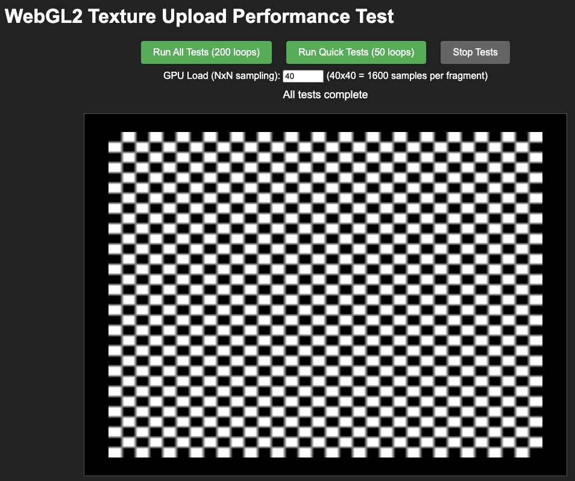
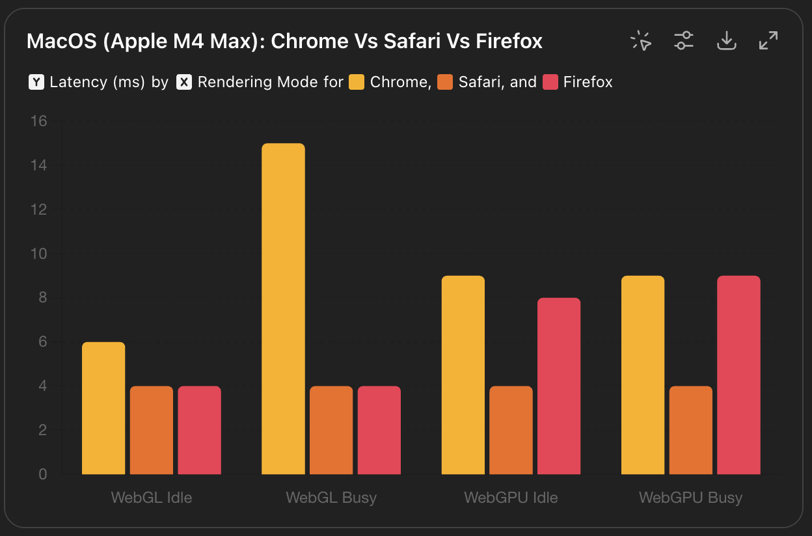
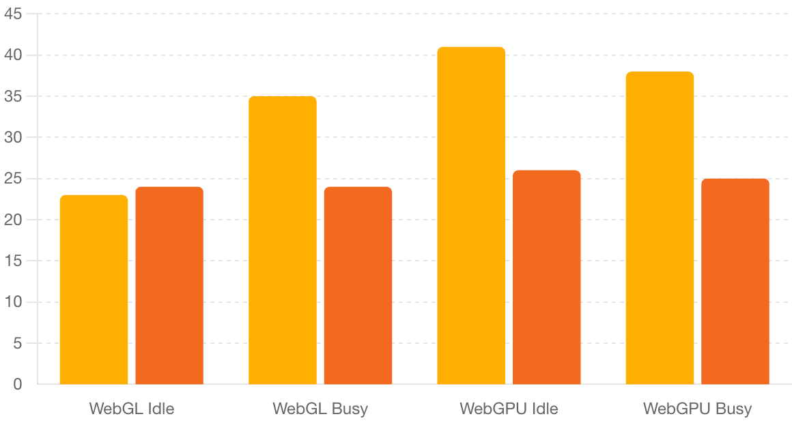

# WebGL/WebGPU Texture Upload Performance Benchmark Suite

A comprehensive benchmarking suite designed to measure and compare texture upload performance across WebGL and WebGPU APIs on various hardware platforms and browsers.

## 🎯 Purpose & Motivation

Modern web graphics applications require efficient texture streaming and upload capabilities. This benchmark suite was created to:

- **Compare WebGL vs WebGPU** texture upload performance across different hardware
- **Identify optimal texture upload strategies** for different texture sizes and scenarios
- **Analyze driver-level optimizations** and their impact on upload performance
- **Provide cross-platform performance data** to guide graphics optimization decisions
- **Test both mutable and immutable texture approaches** in WebGL for comprehensive analysis


*Example of the benchmark suite running with checkerboard texture patterns and real-time performance metrics*

**🚀 [Try the Live Demo](https://mvaligursky.github.io/webgl-webgpu-texture-upload/)**

## 🧪 Test Categories

### WebGL Tests

The WebGL benchmark (`index-webgl.html`) includes **dual-path testing** that compares both mutable (WebGL1-style) and immutable (WebGL2-style) texture approaches:

#### Core Test Types:
1. **Basic Test** - Baseline texture reuse with minimal GPU load (simple shader)
2. **GPU-Stressed Test** - Heavy fragment shader load with NxN sampling
3. **Realloc Test** - Fresh texture allocation each frame + NxN sampling
4. **Buffer-Orphan Test** - Texture orphaning with null data + NxN sampling
5. **Multi-buffer Tests** - Double/triple buffering approaches + NxN sampling
6. **PBO Tests** - Pixel Buffer Object optimizations + NxN sampling
7. **Pack-Align Tests** - Memory alignment optimizations + NxN sampling
8. **Memory Tests** - SharedArrayBuffer and aligned memory + NxN sampling
9. **GPU Sync Tests** - Different GPU synchronization approaches + NxN sampling

**Note**: Only the Basic Test uses a lightweight shader. All other tests use the expensive NxN sampling shader to stress both texture upload and GPU rendering performance.

#### Mutable vs Immutable Comparison:
- **WebGL1 Mode (Mutable)**: Uses `texImage2D` for allocation and `texSubImage2D` for updates
- **WebGL2 Mode (Immutable)**: Uses `texStorage2D` for allocation and `texSubImage2D` for updates

### WebGPU Tests

The WebGPU benchmark (`index-webgpu.html`) focuses on modern GPU API approaches:

#### Core Test Types:
1. **Basic Test** - Standard texture creation and upload (simple shader)
2. **GPU-Stressed Test** - Heavy compute load with NxN sampling  
3. **Realloc Test** - Fresh texture creation each frame + NxN sampling
4. **Multi-buffer Tests** - Multiple texture ping-ponging + NxN sampling
5. **Buffer-Copy Test** - Staging buffer to texture copy + NxN sampling
6. **Queue-Submit Test** - Command queue submission timing + NxN sampling
7. **Memory-Aligned Test** - Memory alignment optimizations + NxN sampling
8. **Storage Buffer Test** - Compute shader with storage buffer bypass + NxN sampling
9. **Tiled Upload Test** - Chunked texture upload approach + NxN sampling

**Note**: Only the Basic Test uses a simple shader. All other tests use the expensive NxN sampling shader to stress both texture upload and GPU rendering performance.

## 🔧 Technical Implementation

### Texture Format
- **Format**: `R32_UINT` (single-channel 32-bit unsigned integer)
- **Data Pattern**: High-contrast checkerboard for optimal blur visibility
- **Size Range**: 256×256 to 4096×4096 pixels
- **Adaptive Check Size**: Larger textures get proportionally larger checkerboard squares

### GPU Load Testing
- **Sampling Pattern**: Configurable NxN grid sampling (default: 40×40 = 1600 samples/fragment)
- **Visual Validation**: Sampling blur effects should be visible and vary with texture size
- **Performance Impact**: Creates realistic GPU load to stress texture bandwidth

### Measurement Methodology
- **Iterations**: 200 loops (full test) or 50 loops (quick test)
- **Timing**: High-precision `performance.now()` measurements
- **Metrics**: Upload time, render time, throughput (MB/s), frame skipping
- **Warmup**: Initial iterations excluded from final averages

## 🚀 How to Run

### Prerequisites
- Modern browser with WebGL2 and/or WebGPU support
- Hardware accelerated graphics

### Running Tests
1. **WebGL Tests**: Open `index-webgl.html`
2. **WebGPU Tests**: Open `index-webgpu.html`
3. **Test Options**:
   - **Run All Tests (200 loops)**: Comprehensive benchmark
   - **Run Quick Tests (50 loops)**: Faster validation
   - **GPU Load**: Adjust NxN sampling (1-50, default: 40)

### Expected Visual Behavior
- **Basic Tests**: Sharp checkerboard pattern
- **GPU-Stressed Tests**: Blurred checkerboard (sampling effect)
- **Size Variation**: Blur intensity should vary with texture size
- **Consistent APIs**: WebGL and WebGPU should show similar visual effects

## 🎯 Key Findings Summary

**The complete benchmark results are detailed below, but here are the main performance insights for 4096×4096 texture uploads:**

### 🍎 macOS (Apple M4 Max): Chrome vs Safari vs Firefox



```
Browser    | WebGL Idle | WebGL Busy | WebGPU Idle | WebGPU Busy
-----------|------------|------------|-------------|------------
Chrome     | ~6ms       | ~15ms      | ~9ms        | ~9ms
Safari     | ~4ms       | ~4ms       | ~4ms        | ~4ms
Firefox    | ~4ms       | ~4ms       | ~8ms        | ~9ms
```

**🏆 Performance Rankings:**
- **WebGL Idle**: Safari ≈ Firefox (tied best) > Chrome (33% slower)
- **WebGL Busy**: Safari ≈ Firefox (tied best) > Chrome (73% slower)  
- **WebGPU Idle**: Safari (best) > Firefox > Chrome
- **WebGPU Busy**: Safari (best) ≈ Firefox > Chrome

**Key Insights:**
- **Safari**: Consistently fastest across all tests, especially strong in WebGPU
- **Firefox**: Excellent WebGL performance matching Safari, good WebGPU performance
- **Chrome**: Slower overall, particularly struggles with WebGL under GPU load

*All browsers show excellent performance on Apple Silicon, with Safari leading and Firefox providing strong competition to Chrome.*

### 🖥️ Windows 11 (Intel i7 + NVIDIA GeForce RTX 2070): Chrome vs Firefox



```
Browser    | WebGL Idle | WebGL Busy | WebGPU Idle | WebGPU Busy
-----------|------------|------------|-------------|------------
Chrome     | ~23ms      | ~35ms      | ~41ms       | ~38ms
Firefox    | ~24ms      | ~24ms      | ~26ms       | ~25ms
```

**🦊 Firefox Advantages:**
- **WebGL Idle**: 4% slower than Chrome (comparable)
- **WebGL Busy**: 31% faster than Chrome
- **WebGPU Idle**: 37% faster than Chrome
- **WebGPU Busy**: 34% faster than Chrome

*Firefox shows superior performance under GPU load conditions.*

---

## 📊 Performance Results by Platform

### Apple M4 Max (MacBook Pro, macOS, Chrome 138.0.0.0)

#### WebGL Results:

**WebGL1 (Mutable Textures):**
```
Test Method  | 256×256  | 512×512  | 1024×1024 | 2048×2048  | 4096×4096 
-------------|----------|----------|-----------|------------|----------
Basic        | 0.03ms   | 0.05ms   | 0.40ms    | 1.67ms     | 6.11ms
GPU-Stress   | 0.35ms ⭐ | 1.82ms   | 1.24ms    | 8.11ms     | 15.11ms
Realloc      | 1.74ms   | 2.93ms   | 2.15ms    | 1.03ms ⭐  | 4.03ms ⭐
Buf-Orphan   | 32.96ms  | 1.77ms   | 1.22ms    | 7.97ms     | 15.15ms
Double-Buf   | 1.47ms   | 1.76ms   | 1.25ms    | 8.32ms     | 15.48ms
Triple-Buf   | 1.54ms   | 1.84ms   | 1.40ms    | 8.84ms     | 16.07ms
Quad-Buf     | 1.68ms   | 1.83ms   | 1.47ms    | 9.28ms     | 16.67ms
Penta-Buf    | 1.88ms   | 1.80ms   | 1.55ms    | 9.51ms     | 17.05ms
PBO-Single   | 1.66ms   | 1.77ms   | 1.13ms ⭐ | 9.87ms     | 30.09ms
PBO-Double   | 0.59ms   | 1.54ms ⭐ | 1.13ms ⭐ | 9.73ms     | 29.53ms
Pack-Aln1    | 0.47ms ⭐ | 1.62ms   | 1.15ms    | 8.12ms     | 15.15ms
Pack-Aln8    | 1.43ms   | 1.67ms   | 1.22ms    | 8.13ms     | 15.19ms
Sync-Flush   | 1.49ms   | 1.59ms   | 1.11ms ⭐ | 7.96ms     | 15.10ms
Sync-Fin     | 1.46ms   | 1.60ms   | 1.14ms    | 7.96ms     | 15.02ms
Sync-None    | 1.41ms   | 1.70ms   | 1.19ms    | 8.07ms     | 15.17ms
Mem-Align    | 1.40ms   | 1.66ms   | 1.20ms    | 8.29ms     | 17.22ms
Mem-Share    | 0.83ms   | 1.60ms   | 1.16ms    | 8.13ms     | 15.12ms
```

**WebGL2 (Immutable Textures):**
```
Test Method  | 256×256  | 512×512  | 1024×1024 | 2048×2048  | 4096×4096 
-------------|----------|----------|-----------|------------|----------
Basic        | 0.94ms   | 0.05ms   | 0.38ms    | 1.78ms     | 6.45ms
GPU-Stress   | 0.41ms   | 1.66ms   | 1.12ms ⭐ | 8.05ms     | 15.22ms
Realloc      | 1.81ms   | 2.67ms   | 2.01ms    | 8.10ms     | 15.09ms ⭐
Buf-Orphan   | 1.41ms   | 1.62ms   | 1.14ms    | 8.13ms     | 15.21ms
Double-Buf   | 1.33ms   | 1.76ms   | 1.21ms    | 8.30ms     | 15.38ms
Triple-Buf   | 1.40ms   | 2.22ms   | 1.56ms    | 8.79ms     | 16.03ms
Quad-Buf     | 1.60ms   | 2.29ms   | 1.80ms    | 9.33ms     | 16.78ms
Penta-Buf    | 1.60ms   | 2.52ms   | 2.16ms    | 10.15ms    | 16.87ms
PBO-Single   | 1.64ms   | 2.41ms   | 1.92ms    | 9.79ms     | 29.26ms
PBO-Double   | 0.51ms   | 1.72ms   | 1.40ms    | 9.62ms     | 29.29ms
Pack-Aln1    | 0.29ms ⭐ | 2.02ms   | 1.53ms    | 8.19ms     | 15.12ms
Pack-Aln8    | 1.38ms   | 2.74ms   | 2.48ms    | 8.82ms     | 15.71ms
Sync-Flush   | 1.59ms   | 3.36ms   | 2.47ms    | 9.18ms     | 15.73ms
Sync-Fin     | 1.60ms   | 2.85ms   | 2.25ms    | 9.14ms     | 15.70ms
Sync-None    | 1.66ms   | 2.89ms   | 2.28ms    | 9.12ms     | 16.04ms
Mem-Align    | 1.62ms   | 3.05ms   | 2.26ms    | 9.60ms     | 17.40ms
Mem-Share    | 1.55ms   | 3.56ms   | 2.29ms    | 9.33ms     | 16.02ms
```

**WebGPU Results:**
```
Test Method  | 256×256  | 512×512  | 1024×1024 | 2048×2048  | 4096×4096 
-------------|----------|----------|-----------|------------|----------
Basic        | 0.03ms   | 0.05ms ⭐ | 0.15ms    | 2.53ms     | 9.21ms
GPU-Stress   | 0.02ms ⭐ | 0.06ms   | 0.14ms ⭐ | 2.37ms ⭐  | 9.08ms ⭐
Realloc      | 0.02ms ⭐ | 0.09ms   | 0.18ms    | 2.77ms     | 9.42ms
Double-Buf   | 0.02ms ⭐ | 0.07ms   | 0.21ms    | 2.90ms     | 9.20ms
Triple-Buf   | 0.02ms ⭐ | 0.08ms   | 0.15ms    | 2.68ms     | 9.36ms
Quad-Buf     | 0.02ms ⭐ | 0.09ms   | 0.28ms    | 2.71ms     | 9.32ms
Penta-Buf    | 0.02ms ⭐ | 0.05ms ⭐ | 0.17ms    | 2.90ms     | 9.44ms
Buf-Copy     | 3.06ms   | 3.30ms   | 3.86ms    | 5.02ms     | 10.65ms
Que-Submit   | 2.85ms   | 2.99ms   | 4.13ms    | 7.00ms     | 15.25ms
Mem-Align    | 0.13ms   | 0.50ms   | 1.35ms    | 5.12ms     | 19.07ms
Storage      | 0.04ms   | 0.05ms ⭐ | 0.13ms ⭐ | 2.78ms     | 9.81ms
Tiled        | 0.38ms   | 0.96ms   | 2.06ms    | 5.53ms     | 75.62ms
GPU-Realloc  | 0.07ms   | 0.09ms   | 0.21ms    | 2.92ms     | 10.82ms
Fresh-Buf    | 3.08ms   | 3.12ms   | 3.97ms    | 5.30ms     | 11.49ms
Map-Buf      | 2.93ms   | 3.22ms   | 3.93ms    | 5.71ms     | 11.66ms
```

**Platform**: Apple M4 Max, macOS, Chrome 138.0.0.0  
**Driver**: ANGLE Metal Renderer

> **⭐ Star Highlighting**: Stars indicate the best performing upload strategy (excluding Basic test) for each texture size. This focuses on upload performance when the GPU is under realistic load, as Basic tests use minimal shader complexity and don't represent real-world usage patterns.

---

### Apple M4 Max (MacBook Pro, macOS, Safari Tech Preview 223)

#### WebGL Results:

**WebGL1 (Mutable Textures):**
```
Test Method  | 256×256  | 512×512  | 1024×1024 | 2048×2048  | 4096×4096 
-------------|----------|----------|-----------|------------|----------
Basic        | 0.01ms   | 0.03ms   | 0.24ms    | 0.94ms     | 3.58ms
GPU-Stress   | 0.01ms ⭐ | 0.01ms ⭐ | 0.23ms    | 0.94ms     | 3.63ms ⭐
Realloc      | 0.01ms ⭐ | 0.01ms ⭐ | 0.25ms    | 0.90ms ⭐  | 3.72ms
Buf-Orphan   | 0.00ms ⭐ | 0.03ms   | 0.25ms    | 0.92ms     | 3.81ms
Double-Buf   | 0.00ms ⭐ | 0.03ms   | 0.24ms    | 0.93ms     | 3.81ms
Triple-Buf   | 0.01ms ⭐ | 0.01ms ⭐ | 0.22ms ⭐ | 1.15ms     | 3.96ms
Quad-Buf     | 0.00ms ⭐ | 0.01ms ⭐ | 0.36ms    | 1.18ms     | 3.92ms
Penta-Buf    | 0.00ms ⭐ | 0.03ms   | 0.23ms    | 1.12ms     | 3.99ms
PBO-Single   | 0.01ms ⭐ | 0.03ms   | 0.27ms    | 1.30ms     | 4.17ms
PBO-Double   | 0.02ms   | 0.02ms   | 0.27ms    | 1.32ms     | 4.18ms
Pack-Aln1    | 0.02ms   | 0.01ms ⭐ | 0.26ms    | 0.99ms     | 3.91ms
Pack-Aln8    | 0.01ms ⭐ | 0.02ms   | 0.26ms    | 1.01ms     | 3.92ms
Sync-Flush   | 0.01ms ⭐ | 0.02ms   | 0.26ms    | 0.99ms     | 3.94ms
Sync-Fin     | 0.01ms ⭐ | 0.03ms   | 0.23ms    | 1.03ms     | 3.91ms
Sync-None    | 0.01ms ⭐ | 0.01ms ⭐ | 0.25ms    | 1.00ms     | 3.95ms
Mem-Align    | 0.05ms   | 0.08ms   | 0.48ms    | 1.81ms     | 6.42ms
Mem-Share    | 0.00ms ⭐ | 0.02ms   | 0.29ms    | 1.04ms     | 4.00ms
```

**WebGL2 (Immutable Textures):**
```
Test Method  | 256×256  | 512×512  | 1024×1024 | 2048×2048  | 4096×4096 
-------------|----------|----------|-----------|------------|----------
Basic        | 0.02ms   | 0.03ms   | 0.28ms    | 1.02ms     | 3.94ms
GPU-Stress   | 0.01ms   | 0.01ms ⭐ | 0.27ms    | 1.02ms     | 4.02ms
Realloc      | 0.01ms   | 0.01ms ⭐ | 0.27ms    | 1.00ms     | 3.97ms
Buf-Orphan   | 0.00ms ⭐ | 0.03ms   | 0.24ms    | 1.00ms     | 3.94ms
Double-Buf   | 0.00ms ⭐ | 0.01ms ⭐ | 0.25ms    | 1.21ms     | 3.84ms
Triple-Buf   | 0.01ms   | 0.03ms   | 0.28ms    | 1.18ms     | 3.93ms
Quad-Buf     | 0.03ms   | 0.06ms   | 0.35ms    | 1.19ms     | 3.90ms
Penta-Buf    | 0.01ms   | 0.02ms   | 0.24ms    | 1.00ms     | 3.94ms
PBO-Single   | 0.00ms ⭐ | 0.02ms   | 0.31ms    | 1.32ms     | 4.19ms
PBO-Double   | 0.00ms ⭐ | 0.03ms   | 0.30ms    | 1.32ms     | 4.18ms
Pack-Aln1    | 0.00ms ⭐ | 0.02ms   | 0.28ms    | 0.97ms ⭐  | 3.86ms
Pack-Aln8    | 0.00ms ⭐ | 0.01ms ⭐ | 0.25ms    | 0.99ms     | 3.89ms
Sync-Flush   | 0.00ms ⭐ | 0.02ms   | 0.24ms    | 1.00ms     | 3.89ms
Sync-Fin     | 0.01ms   | 0.02ms   | 0.26ms    | 0.98ms     | 3.97ms
Sync-None    | 0.00ms ⭐ | 0.02ms   | 0.23ms ⭐ | 0.98ms     | 3.90ms
Mem-Align    | 0.03ms   | 0.09ms   | 0.46ms    | 1.67ms     | 6.20ms
Mem-Share    | 0.01ms   | 0.01ms ⭐ | 0.28ms    | 0.99ms     | 3.79ms ⭐
```

**WebGPU Results:**
```
Test Method  | 256×256  | 512×512  | 1024×1024 | 2048×2048  | 4096×4096 
-------------|----------|----------|-----------|------------|----------
Basic        | 0.12ms   | 0.31ms   | 1.19ms    | 4.86ms     | 3.74ms
GPU-Stress   | 0.08ms   | 0.30ms   | 1.20ms    | 4.75ms ⭐  | 3.76ms ⭐
Realloc      | 0.07ms   | 0.27ms ⭐ | 1.21ms    | 4.84ms     | 3.88ms
Double-Buf   | 0.06ms   | 0.28ms   | 1.22ms    | 4.98ms     | 3.91ms
Triple-Buf   | 0.05ms   | 0.31ms   | 1.28ms    | 5.14ms     | 3.93ms
Quad-Buf     | 0.04ms ⭐ | 0.31ms   | 1.30ms    | 5.19ms     | 4.10ms
Penta-Buf    | 0.08ms   | 0.32ms   | 1.30ms    | 5.22ms     | 4.07ms
Buf-Copy     | 0.59ms   | 1.27ms   | 5.28ms    | 19.10ms    | 43.40ms
Que-Submit   | 0.28ms   | 0.76ms   | 2.83ms    | 11.40ms    | 15.57ms
Mem-Align    | 0.07ms   | 0.39ms   | 1.45ms    | 5.76ms     | 6.37ms
Storage      | 0.10ms   | 0.42ms   | 1.30ms    | 5.25ms     | 4.22ms
Tiled        | 0.55ms   | 2.00ms   | 7.97ms    | 33.30ms    | 157.12ms
GPU-Realloc  | 0.10ms   | 0.28ms   | 1.29ms    | 5.06ms     | 4.04ms
Fresh-Buf    | 0.53ms   | 1.25ms   | 5.28ms    | 19.42ms    | 45.10ms
Map-Buf      | 0.55ms   | 1.26ms   | 5.16ms    | 19.11ms    | 45.01ms
```

**Platform**: Apple M4 Max, macOS, Safari Tech Preview 223  
**Driver**: WebKit WebGPU Implementation

---

### Apple M4 Max (Firefox 140.0)

#### WebGL Results:

**WebGL1 (Mutable Textures):**
```
Test Method  | 256×256  | 512×512  | 1024×1024 | 2048×2048  | 4096×4096 
-------------|----------|----------|-----------|------------|----------
Basic        | 0.03ms   | 0.15ms   | 0.29ms    | 0.98ms     | 3.96ms
GPU-Stress   | 0.04ms   | 0.08ms   | 0.28ms    | 1.07ms     | 4.22ms
Realloc      | 0.03ms   | 0.12ms   | 0.28ms    | 1.19ms     | 4.13ms ⭐
Buf-Orphan   | 0.03ms   | 0.07ms   | 0.26ms    | 1.23ms     | 4.22ms
Double-Buf   | 0.03ms   | 0.07ms   | 0.30ms    | 1.08ms     | 4.38ms
Triple-Buf   | 0.03ms   | 0.09ms   | 0.27ms    | 1.08ms     | 4.30ms
Quad-Buf     | 0.03ms   | 0.09ms   | 0.28ms    | 1.08ms     | 4.36ms
Penta-Buf    | 0.03ms   | 0.08ms   | 0.30ms    | 1.07ms ⭐  | 4.38ms
PBO-Single   | 0.03ms   | 0.08ms   | 0.39ms    | 1.37ms     | 4.53ms
PBO-Double   | 0.03ms   | 0.10ms   | 0.30ms    | 1.33ms     | 4.51ms
Pack-Aln1    | 0.03ms   | 0.09ms   | 0.30ms    | 1.13ms     | 4.36ms
Pack-Aln8    | 0.02ms ⭐ | 0.06ms ⭐ | 0.28ms    | 1.13ms     | 4.41ms
Sync-Flush   | 0.04ms   | 0.10ms   | 0.29ms    | 1.32ms     | 4.41ms
Sync-Fin     | 4.38ms   | 1.77ms   | 2.32ms    | 11.05ms    | 24.19ms
Sync-None    | 0.02ms ⭐ | 0.10ms   | 0.23ms ⭐ | 1.14ms     | 4.37ms
Mem-Align    | 0.09ms   | 0.29ms   | 1.05ms    | 4.06ms     | 15.97ms
Mem-Share    | 0.04ms   | 0.10ms   | 0.27ms    | 1.09ms     | 4.38ms
```

**WebGL2 (Immutable Textures):**
```
Test Method  | 256×256  | 512×512  | 1024×1024 | 2048×2048  | 4096×4096 
-------------|----------|----------|-----------|------------|----------
Basic        | 0.04ms   | 0.14ms   | 0.28ms    | 1.03ms     | 4.18ms
GPU-Stress   | 0.02ms   | 0.05ms ⭐ | 0.31ms    | 1.08ms     | 4.41ms
Realloc      | 0.04ms   | 0.11ms   | 0.29ms    | 1.24ms     | 4.32ms ⭐
Buf-Orphan   | 0.04ms   | 0.07ms   | 0.28ms    | 1.06ms ⭐  | 4.33ms
Double-Buf   | 0.03ms   | 0.07ms   | 0.27ms ⭐ | 1.17ms     | 4.33ms
Triple-Buf   | 0.03ms   | 0.08ms   | 0.28ms    | 1.08ms     | 4.32ms ⭐
Quad-Buf     | 0.04ms   | 0.08ms   | 0.32ms    | 1.16ms     | 4.33ms
Penta-Buf    | 0.03ms   | 0.07ms   | 0.28ms    | 1.07ms     | 4.38ms
PBO-Single   | 0.04ms   | 0.10ms   | 0.35ms    | 1.40ms     | 4.48ms
PBO-Double   | 0.03ms   | 0.08ms   | 0.34ms    | 1.37ms     | 4.52ms
Pack-Aln1    | 0.04ms   | 0.09ms   | 0.28ms    | 1.08ms     | 4.35ms
Pack-Aln8    | 0.01ms ⭐ | 0.08ms   | 0.29ms    | 1.06ms ⭐  | 4.42ms
Sync-Flush   | 0.03ms   | 0.10ms   | 0.34ms    | 1.27ms     | 4.42ms
Sync-Fin     | 4.38ms   | 1.82ms   | 2.30ms    | 11.11ms    | 24.16ms
Sync-None    | 0.04ms   | 0.09ms   | 0.28ms    | 1.10ms     | 4.33ms
Mem-Align    | 0.07ms   | 0.32ms   | 1.00ms    | 4.08ms     | 16.23ms
Mem-Share    | 0.04ms   | 0.05ms ⭐ | 0.28ms    | 1.07ms     | 6.73ms
```

**WebGPU Results:**
```
Test Method  | 256×256  | 512×512  | 1024×1024 | 2048×2048  | 4096×4096 
-------------|----------|----------|-----------|------------|----------
Basic        | 0.28ms   | 0.57ms   | 1.67ms    | 5.22ms     | 8.66ms
GPU-Stress   | 0.28ms   | 0.62ms   | 1.71ms    | 5.24ms     | 8.64ms
Realloc      | 0.29ms   | 0.49ms ⭐ | 1.68ms    | 5.01ms ⭐  | 8.37ms
Double-Buf   | 0.26ms ⭐ | 0.53ms   | 1.68ms    | 5.12ms     | 8.71ms
Triple-Buf   | 0.27ms   | 0.64ms   | 1.55ms ⭐ | 5.13ms     | 8.64ms
Quad-Buf     | 0.27ms   | 0.64ms   | 1.58ms    | 5.02ms     | 8.68ms
Penta-Buf    | 0.28ms   | 0.51ms   | 1.59ms    | 5.21ms     | 8.74ms
Buf-Copy     | 102.72ms | 102.68ms | 102.72ms  | 102.75ms   | 102.53ms
Que-Submit   | 102.47ms | 102.70ms | 102.70ms  | 102.58ms   | 102.81ms
Mem-Align    | 0.69ms   | 1.50ms   | 4.07ms    | 11.29ms    | 19.08ms
Storage      | 0.30ms   | 0.57ms   | 1.73ms    | 5.21ms     | 8.26ms ⭐
Tiled        | 1.97ms   | 3.77ms   | 7.83ms    | 19.86ms    | 112.47ms
GPU-Realloc  | 0.34ms   | 0.63ms   | 1.77ms    | 5.17ms     | 8.29ms
Fresh-Buf    | 103.14ms | 102.75ms | 102.47ms  | 102.63ms   | 103.61ms
Map-Buf      | 102.55ms | 102.58ms | 102.61ms  | 102.62ms   | 102.56ms
```

**Platform**: Apple M4 Max, macOS, Firefox 142.0  
**GPU**: Apple M1, or similar (Firefox WebGPU reporting)  
**Driver**: Mozilla/5.0 Gecko WebGPU Implementation

---

### Windows 11 (Chrome 138.0.0.0, NVIDIA GeForce RTX 2070)

#### WebGL Results:

**WebGL1 (Mutable Textures):**
```
Test Method  | 256×256  | 512×512  | 1024×1024 | 2048×2048  | 4096×4096 
-------------|----------|----------|-----------|------------|----------
Basic        | 0.05ms   | 0.12ms   | 1.09ms    | 4.81ms     | 22.51ms
GPU-Stress   | 1.83ms   | 6.47ms   | 2.85ms    | 8.75ms     | 34.86ms
Realloc      | 1.85ms   | 5.24ms   | 2.67ms    | 4.43ms ⭐  | 22.55ms ⭐
Buf-Orphan   | 32.92ms  | 6.46ms   | 2.84ms    | 9.38ms     | 39.06ms
Double-Buf   | 1.67ms   | 3.81ms   | 2.51ms ⭐ | 9.64ms     | 37.89ms
Triple-Buf   | 1.63ms   | 4.81ms   | 2.56ms    | 8.51ms     | 36.79ms
Quad-Buf     | 2.79ms   | 3.27ms ⭐ | 2.82ms    | 9.61ms     | 37.47ms
Penta-Buf    | 2.63ms   | 3.41ms   | 2.53ms    | 7.84ms     | 37.44ms
PBO-Single   | 6.92ms   | 11.06ms  | 11.02ms   | 16.73ms    | 43.62ms
PBO-Double   | 5.85ms   | 10.69ms  | 8.78ms    | 10.20ms    | 31.74ms
Pack-Aln1    | 1.54ms ⭐ | 5.11ms   | 2.69ms    | 9.20ms     | 36.44ms
Pack-Aln8    | 2.91ms   | 4.98ms   | 3.01ms    | 9.23ms     | 37.25ms
Sync-Flush   | 3.88ms   | 3.47ms   | 2.48ms    | 9.19ms     | 23.16ms
Sync-Fin     | 1.24ms   | 4.01ms   | 2.99ms    | 6.40ms     | 23.11ms
Sync-None    | 1.96ms   | 5.01ms   | 2.77ms    | 8.91ms     | 36.17ms
Mem-Align    | 2.51ms   | 3.39ms   | 3.03ms    | 13.34ms    | 63.81ms
Mem-Share    | 3.78ms   | 3.75ms   | 2.88ms    | 9.75ms     | 37.57ms
```

**WebGL2 (Immutable Textures):**
```
Test Method  | 256×256  | 512×512  | 1024×1024 | 2048×2048  | 4096×4096 
-------------|----------|----------|-----------|------------|----------
Basic        | 0.77ms   | 0.14ms   | 1.07ms    | 4.69ms     | 24.49ms
GPU-Stress   | 1.08ms   | 6.27ms   | 2.75ms    | 9.08ms     | 36.82ms
Realloc      | 1.73ms   | 5.78ms   | 2.42ms    | 14.97ms    | 45.42ms
Buf-Orphan   | 1.22ms   | 6.41ms   | 2.77ms    | 8.27ms     | 38.59ms
Double-Buf   | 1.90ms   | 3.41ms   | 2.43ms    | 8.16ms ⭐  | 38.73ms
Triple-Buf   | 1.93ms   | 5.94ms   | 2.83ms    | 8.27ms     | 39.89ms
Quad-Buf     | 1.50ms   | 3.79ms   | 2.38ms ⭐ | 8.42ms     | 36.14ms
Penta-Buf    | 2.21ms   | 6.91ms   | 2.72ms    | 8.58ms     | 38.51ms
PBO-Single   | 5.58ms   | 10.93ms  | 10.64ms   | 17.13ms    | 44.24ms
PBO-Double   | 5.87ms   | 10.72ms  | 9.22ms    | 10.56ms    | 30.84ms
Pack-Aln1    | 1.01ms ⭐ | 6.39ms   | 2.61ms    | 10.18ms    | 36.24ms
Pack-Aln8    | 2.53ms   | 4.80ms   | 2.67ms    | 8.42ms     | 37.21ms
Sync-Flush   | 1.35ms   | 3.11ms ⭐ | 2.64ms    | 9.89ms     | 23.39ms
Sync-Fin     | 0.98ms ⭐ | 3.07ms   | 2.81ms    | 9.61ms     | 22.97ms ⭐
Sync-None    | 1.04ms   | 3.46ms   | 2.56ms    | 8.51ms     | 39.71ms
Mem-Align    | 3.23ms   | 3.11ms   | 2.83ms    | 13.65ms    | 63.61ms
Mem-Share    | 1.05ms   | 5.43ms   | 2.70ms    | 9.36ms     | 37.70ms
```

**WebGPU Results:**
```
Test Method  | 256×256  | 512×512  | 1024×1024 | 2048×2048  | 4096×4096 
-------------|----------|----------|-----------|------------|----------
Basic        | 0.04ms   | 0.09ms   | 0.38ms    | 9.55ms     | 41.10ms
GPU-Stress   | 0.05ms   | 0.13ms   | 0.53ms    | 9.99ms     | 37.56ms ⭐
Realloc      | 0.03ms ⭐ | 0.11ms   | 0.46ms    | 10.64ms    | 40.35ms
Double-Buf   | 0.04ms   | 0.11ms   | 0.42ms ⭐ | 9.54ms ⭐  | 38.53ms
Triple-Buf   | 0.05ms   | 0.10ms ⭐ | 0.45ms    | 9.62ms     | 37.91ms
Quad-Buf     | 0.03ms ⭐ | 0.11ms   | 0.43ms    | 9.58ms     | 38.54ms
Penta-Buf    | 0.04ms   | 0.13ms   | 0.45ms    | 9.79ms     | 37.80ms
Buf-Copy     | 3.04ms   | 2.89ms   | 4.15ms    | 12.68ms    | 31.57ms ⭐
Que-Submit   | 2.96ms   | 2.96ms   | 4.08ms    | 18.04ms    | 61.69ms
Mem-Align    | 0.21ms   | 0.63ms   | 2.34ms    | 17.46ms    | 67.86ms
Storage      | 0.07ms   | 0.16ms   | 0.54ms    | 11.59ms    | 43.50ms
Tiled        | 0.31ms   | 0.87ms   | 2.98ms    | 12.23ms    | 92.89ms
GPU-Realloc  | 0.08ms   | 0.18ms   | 0.53ms    | 11.44ms    | 46.88ms
Fresh-Buf    | 3.00ms   | 4.67ms   | 5.02ms    | 11.35ms    | 53.27ms
Map-Buf      | 2.97ms   | 3.24ms   | 5.36ms    | 12.96ms    | 42.13ms
```

**Platform**: Windows 11, Chrome 138.0.0.0  
**GPU**: NVIDIA GeForce RTX 2070  
**Driver**: ANGLE Direct3D11 vs_5.0 ps_5.0

---

### Windows 11 (Firefox 141.0, NVIDIA GeForce GTX 980)

#### WebGL Results:

**WebGL1 (Mutable Textures):**
```
Test Method  | 256×256  | 512×512  | 1024×1024 | 2048×2048  | 4096×4096 
-------------|----------|----------|-----------|------------|----------
Basic        | 0.11ms   | 0.54ms   | 1.60ms    | 6.68ms     | 24.32ms
GPU-Stress   | 0.15ms   | 0.42ms ⭐ | 1.38ms    | 5.95ms     | 24.38ms
Realloc      | 0.15ms   | 0.43ms   | 1.51ms    | 5.79ms ⭐  | 23.48ms ⭐
Buf-Orphan   | 0.17ms   | 0.47ms   | 1.36ms    | 6.13ms     | 23.75ms
Double-Buf   | 0.17ms   | 0.41ms   | 1.34ms    | 5.84ms     | 24.34ms
Triple-Buf   | 0.15ms   | 0.47ms   | 1.41ms    | 6.14ms     | 24.03ms
Quad-Buf     | 0.17ms   | 0.54ms   | 1.42ms    | 6.18ms     | 23.84ms
Penta-Buf    | 0.14ms ⭐ | 0.47ms   | 1.38ms    | 6.19ms     | 23.82ms
PBO-Single   | 0.21ms   | 0.57ms   | 1.53ms    | 7.65ms     | 30.18ms
PBO-Double   | 0.16ms   | 0.60ms   | 1.59ms    | 7.67ms     | 30.20ms
Pack-Aln1    | 0.14ms ⭐ | 0.47ms   | 1.31ms ⭐ | 6.38ms     | 24.63ms
Pack-Aln8    | 0.14ms ⭐ | 0.48ms   | 1.43ms    | 6.29ms     | 25.17ms
Sync-Flush   | 0.19ms   | 0.52ms   | 1.57ms    | 7.25ms     | 29.84ms
Sync-Fin     | 14.76ms  | 15.01ms  | 18.64ms   | 34.58ms    | 90.16ms
Sync-None    | 0.14ms ⭐ | 0.47ms   | 1.33ms    | 6.17ms     | 24.14ms
Mem-Align    | 0.28ms   | 1.05ms   | 3.67ms    | 14.32ms    | 51.78ms
Mem-Share    | 0.17ms   | 0.44ms   | 1.36ms    | 6.28ms     | 24.56ms
```

**WebGL2 (Immutable Textures):**
```
Test Method  | 256×256  | 512×512  | 1024×1024 | 2048×2048  | 4096×4096 
-------------|----------|----------|-----------|------------|----------
Basic        | 0.12ms   | 0.52ms   | 1.46ms    | 6.39ms     | 24.25ms
GPU-Stress   | 0.14ms   | 0.42ms   | 1.36ms    | 6.25ms     | 23.85ms ⭐
Realloc      | 0.14ms   | 0.43ms   | 1.44ms    | 5.73ms ⭐  | 23.94ms
Buf-Orphan   | 0.12ms ⭐ | 0.44ms   | 1.33ms    | 6.21ms     | 24.14ms
Double-Buf   | 0.15ms   | 0.56ms   | 1.30ms ⭐ | 6.24ms     | 24.27ms
Triple-Buf   | 0.17ms   | 0.41ms ⭐ | 1.36ms    | 6.06ms     | 24.02ms
Quad-Buf     | 0.15ms   | 0.40ms ⭐ | 1.35ms    | 6.21ms     | 24.09ms
Penta-Buf    | 0.14ms   | 0.46ms   | 1.46ms    | 6.05ms     | 23.84ms
PBO-Single   | 0.20ms   | 0.56ms   | 1.53ms    | 7.55ms     | 29.54ms
PBO-Double   | 0.19ms   | 0.54ms   | 1.55ms    | 7.60ms     | 29.77ms
Pack-Aln1    | 0.13ms   | 0.55ms   | 1.43ms    | 6.26ms     | 24.70ms
Pack-Aln8    | 0.15ms   | 0.68ms   | 1.70ms    | 6.28ms     | 24.64ms
Sync-Flush   | 0.22ms   | 0.52ms   | 1.59ms    | 7.38ms     | 30.77ms
Sync-Fin     | 15.24ms  | 15.18ms  | 25.39ms   | 28.16ms    | 87.80ms
Sync-None    | 0.16ms   | 0.45ms   | 1.34ms    | 6.11ms     | 23.73ms
Mem-Align    | 0.28ms   | 0.97ms   | 3.69ms    | 14.79ms    | 53.11ms
Mem-Share    | 0.14ms   | 0.45ms   | 1.31ms    | 6.08ms     | 24.32ms
```

**WebGPU Results:**
```
Test Method  | 256×256  | 512×512  | 1024×1024 | 2048×2048  | 4096×4096 
-------------|----------|----------|-----------|------------|----------
Basic        | 0.20ms   | 0.45ms   | 1.78ms    | 6.92ms     | 26.28ms
GPU-Stress   | 0.20ms   | 0.51ms   | 1.72ms ⭐ | 6.38ms ⭐  | 24.98ms ⭐
Realloc      | 0.13ms ⭐ | 0.60ms   | 1.90ms    | 6.73ms     | 25.52ms
Double-Buf   | 0.28ms   | 0.56ms   | 1.93ms    | 7.63ms     | 25.33ms
Triple-Buf   | 0.14ms   | 0.53ms ⭐ | 1.85ms    | 6.63ms     | 24.77ms
Quad-Buf     | 0.17ms   | 0.54ms   | 1.73ms    | 6.46ms     | 24.89ms
Penta-Buf    | 0.19ms   | 0.63ms   | 2.10ms    | 7.50ms     | 25.21ms
Buf-Copy     | 98.89ms  | 103.92ms | 98.81ms   | 100.08ms   | 105.92ms
Que-Submit   | 99.53ms  | 98.91ms  | 100.32ms  | 102.72ms   | 106.55ms
Mem-Align    | 0.34ms   | 1.12ms   | 3.79ms    | 13.03ms    | 48.06ms
Storage      | 0.24ms   | 0.59ms   | 1.76ms    | 6.71ms     | 25.59ms
Tiled        | 0.77ms   | 1.73ms   | 5.22ms    | 20.98ms    | 219.04ms
GPU-Realloc  | 0.24ms   | 0.61ms   | 1.91ms    | 7.47ms     | 26.37ms
Fresh-Buf    | 101.16ms | 100.93ms | 100.82ms  | 101.06ms   | 103.05ms
Map-Buf      | 106.01ms | 99.94ms  | 100.58ms  | 100.16ms   | 105.50ms
```

**Platform**: Windows 11, Firefox 141.0  
**GPU**: NVIDIA GeForce GTX 980  
**Driver**: ANGLE Direct3D11 vs_5.0 ps_5.0

## 🤖 Development Credits

This repository was built using **Windsurf with Claude Sonnet 3.5** - an AI-powered development environment that enabled rapid prototyping, comprehensive testing, and detailed performance analysis across WebGL and WebGPU APIs.

## 📝 License

MIT License - Feel free to use, modify, and distribute.

## 🔗 References

- [WebGL Specification](https://www.khronos.org/webgl/)
- [WebGPU Specification](https://gpuweb.github.io/gpuweb/)
- [Texture Upload Optimization Techniques](https://developer.nvidia.com/content/constant-buffers-without-constant-pain-0)
